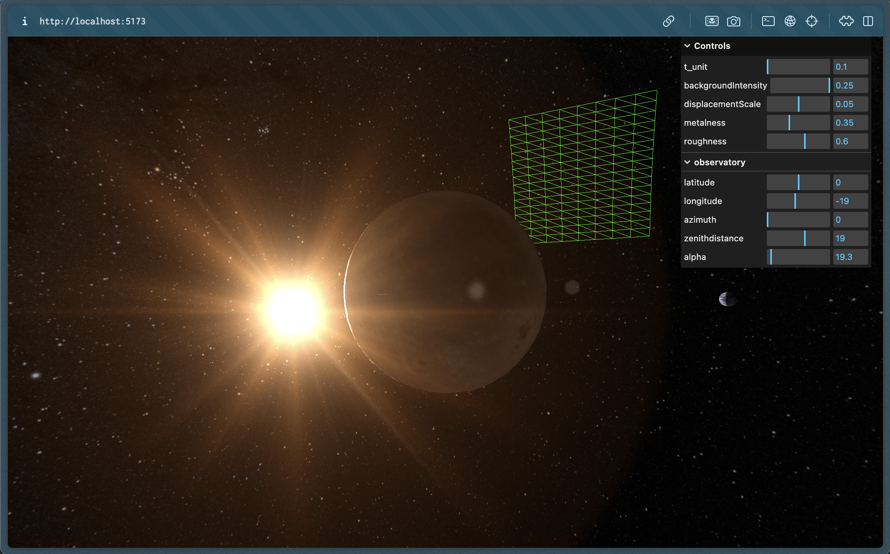

# moon3viz



Been studying the exposure of a lunar observatory to galactic sources.
Spheres in 2D hurt my brain, so I have thought of this visualizer.
Portrays Moon, Earth, Sun and the field of view of an hypothetic observatory.
The observatory parameter (selenographic coordinates, attitude, field of view) are adjustable.
Please don't take this as accurate because it isn't.

As a template for the project I used a generic one made by Bruno Simon for [3js journey](https://threejs-journey.com/#presentation). Please check it out if you are interested in 3js, it's great and Bruno is a true artist. 

I am redistributing maps and images from 
[NASA CGI Moon Kit](https://svs.gsfc.nasa.gov/cgi-bin/details.cgi?aid=4720),
[NASA Deep Star Maps 2020](https://svs.gsfc.nasa.gov/4851/) and 
[NASA blue marble collection](https://visibleearth.nasa.gov/collection/1484/blue-marble).
Please NASA don't sue me, I cannot find the proper licenses.

## Setup
You need [Node.js](https://nodejs.org/en/download/).
Then move to the project's folder and call:

``` bash
# Install dependencies (only the first time)
npm install

# Run the local server at localhost:8080
npm run dev
```

You should get the visualization running in your favourite folder.